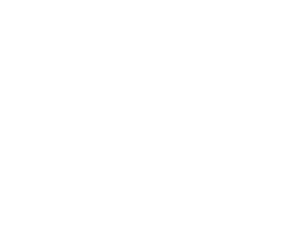
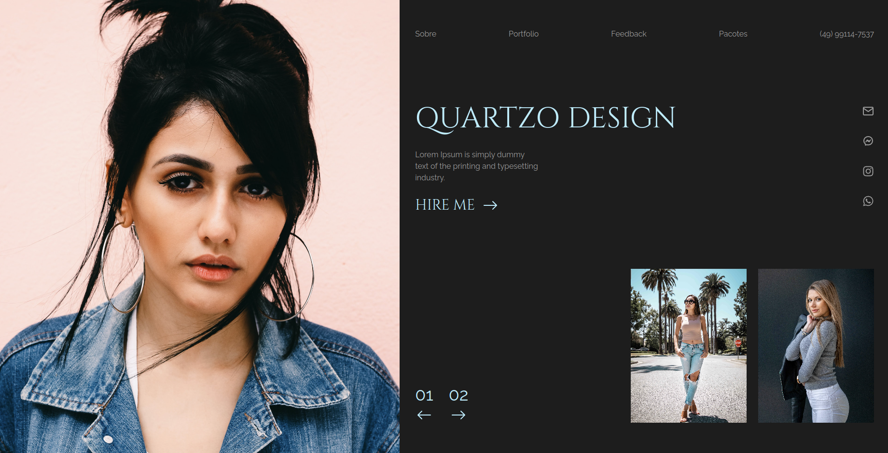

<h1 align="center"></h1>

<h3 align="center">Quartzo</h3>

<p align="center">“Software developers are students forever 🧠”</p>

<p align="center">
  <a href="#about">Sobre</a>&nbsp;&nbsp;&nbsp;|&nbsp;&nbsp;&nbsp;
  <a href="#install">Instalação</a>&nbsp;&nbsp;&nbsp;|&nbsp;&nbsp;&nbsp;
  <a href="#challenge">Desafios</a>&nbsp;&nbsp;&nbsp;|&nbsp;&nbsp;&nbsp;
  <a href="#technologies">Tecnologias</a>
</p>

## :speech_balloon: Sobre <a name="about"></a>

> [Quartzo](https://quartzodesign.vercel.app/) é um esboço de um possível portfólio para fotógrafos.

<br />
<table>
  <tr>
    <td colspan="1">Web App</td>
  </tr>
  <tr>
    <td></td></td>
  </tr>
</table>

## :warning: Instalação <a name="install"></a>

```bash
# Instalar as dependências necessárias:
$ yarn install

# Iniciar o projeto:
$ yarn dev
```

## :triangular_flag_on_post: Desafio <a name="challenge"></a>

> Utilização do Chakra para construção de interfaces web.

## :heavy_check_mark: Tecnologias <a name="technologies"></a>

-   [Chakra](https://chakra-ui.com/)
-   [TypeScript](https://www.typescriptlang.org/)

---

by [Douglas Scaini](https://www.github.com/douglasscaini) ❤️
